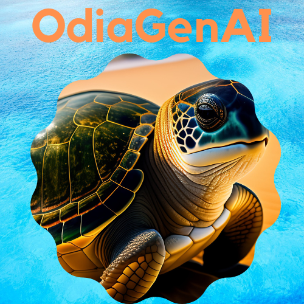

# OdiaGenAI: Generative AI and LLM Initiative for the Odia Language

[](https://huggingface.co/OdiaGenAI)
[](https://creativecommons.org/licenses/by-nc-sa/4.0/)

<p align="center">
  
</p>

[](https://twitter.com/OdiaGenAI)
[](https://discord.gg/bqrzkYAd)

## Table of contents

- [Odia Generative AI (OdiaGen)](#odia-generative-ai-odiagen)
  - [Table of contents](#table-of-contents)
  - [Latest Updates](latest_updates)
  - [About](#about)
  - [Objective](#objective)
  - [Why OdiaGenAI](#why-odiagenai)
  - [What are the focus research areas of OdiaGenAI](#what-are-the-focus-research-areas-of-odiagenai)
  - [Who can use OdiaGenAI LLMs](#who-can-use-odiagenai-llms)
  - [What are the use cases of OdiaGenAI LLMs](#what-are-the-use-cases-of-odiagenai-llms)
  - [Apps](#apps)
  - [Contributors](#contributors)
  - [Contact](#contact)
  - [Citation](#citation)
  - [License](#license)

## Latest Updates
- **[12thApril2023]** We released our first experiment Odia LLM [odiagenAI-model-v0](https://huggingface.co/OdiaGenAI/odiagenAI-model-v0). Please go through our [Blog](https://www.odiagenai.org/blog/odiagenai-released-the-first-llm-for-the-low-resource-odia-language) for more details.    

## About

The Odia Generative AI (in short, OdiaGenAI) is an initiative to research Generative AI and Large Language Models (LLMs) for the low-resource Odia language.

## Objective

The OdiaGenAI aims to

1. Build pre-trained Odia LLM,
2. Fine-tuned Odia LLM, and
3. Instruct LLM (Odia).

The data, code, and models will be available to the public for research and non-commercial purposes.

## Why OdiaGenAI

- **First**: Though many LLMs support multilingual, including Odia language, the performance for various tasks (e.g., content generation, question-answering) is limited due to the amount of ingested data for Odia.
- **Second**: There is subscription or fees associated with the high-performing LLMs.

- **Third**: The usage (privacy) and bias of data input to these LLMs are in question.

## What are the focus research areas of OdiaGenAI

We have divided the primary focus areas into three parts.

**1. Literature Survey:** Investigate the latest developments in Generative AI and LLMs and analyze current methods to support the Odia language for different tasks.

**2. Development:** Developing pre-trained and fine-tuned Odia LLM, which includes dataset preparation, model training, evaluation, prompt engineering, and API development.

**3. Deployment:** Deploy the Odia LLM models for public access for research and non-commercial purposes.

## Who can use OdiaGenAI LLMs

The models (pre-trained/fine-tuned) will be available through Hugging Face for research and non-commercial purposes. Feel free to contact us for a domain-specific application or particular use cases.

## What are the use cases of OdiaGenAI LLMs

There are several use cases of OdiaGenAI LLMs. Three primary domains relating to Odisha which we are focusing to use the developed LLM are:

- Education
- Healthcare
- Governance
- Tourism
- Agriculture
- Industrial Application

## Apps

- [Translate to Indic Languages From English](apps/translate-to-indic-lang/README.md)

## Contributors

- [Shantipriya Parida](https://www.linkedin.com/in/shantipriya-parida-9781a9127/)
- [Sambit Sekhar](https://www.linkedin.com/in/sambit-sekhar-ai/)
- [Subhadarshi Panda](https://www.linkedin.com/in/subhadarshi-panda-1ba5091a/)
- [Soumendra Kumar Sahoo](https://www.linkedin.com/in/soumendrak/)
- [Swateek Jena](https://www.linkedin.com/in/swateek/)
- [Abhijeet Parida](https://www.linkedin.com/in/a-parida/)
- [Arghyadeep Sen](https://www.linkedin.com/in/arghyadeep-sen-kiit/)
- [Dr. Satya Ranjan Dash](https://ksca.kiit.ac.in/profiles/satya-ranjan-dash/)
- [Deepak Kumar Pradhan](https://www.linkedin.com/in/dkpradhan/)

*About our logo:* The critically endangered [Olive Ridley](https://roundglasssustain.com/photostories/olive-ridley-turtles-endangered) sea turtle is the world's smallest and most prevalent marine turtle. Travel thousands of kilometers in the ocean for nesting. The Gahirmatha Marine Sanctuary in [Odisha](https://en.wikipedia.org/wiki/Odisha) is the largest known mass nesting rookery for olive ridley sea turtles worldwide.

## Contact

Please contact Shantipriya Parida (shantipriya.parida@gmail.com) for any contribution/support/usage.

## Supporters
[Odias in Machine Learning](https://www.odisha.ml/)

## Citation

If you find this repository useful, please consider giving ⭐ and citing:

```
@misc{OdiaGenAI,
  author = {Shantipriya Parida and Sambit Sekhar and Subhadarshi Panda and Soumendra Kumar Sahoo and Swateek Jena and Abhijeet Parida and Arghyadeep Sen and Satya Ranjan Dash and Deepak Kumar Pradhan},
  title = {OdiaGenAI: Generative AI and LLM Initiative for the Odia Language},
  year = {2023},
  publisher = {GitHub},
  journal = {GitHub repository},
  howpublished = {\url{https://github.com/shantipriyap/OdiaGenAI}},
}
```

## License

This work is licensed under a
[Creative Commons Attribution-NonCommercial-ShareAlike 4.0 International License][cc-by-nc-sa].

[![CC BY-NC-SA 4.0][cc-by-nc-sa-image]][cc-by-nc-sa]

[cc-by-nc-sa]: http://creativecommons.org/licenses/by-nc-sa/4.0/
[cc-by-nc-sa-image]: https://licensebuttons.net/l/by-nc-sa/4.0/88x31.png
[cc-by-nc-sa-shield]: https://img.shields.io/badge/License-CC%20BY--NC--SA%204.0-lightgrey.svg
